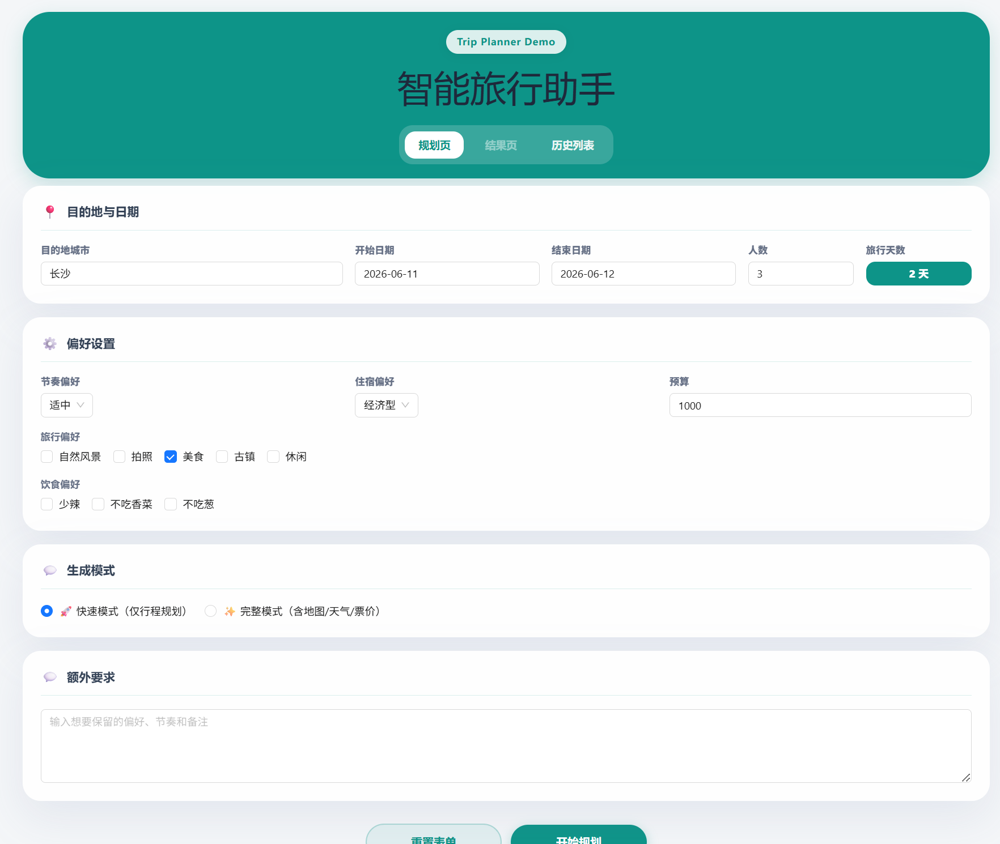
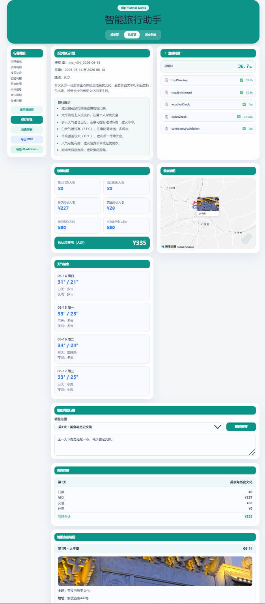
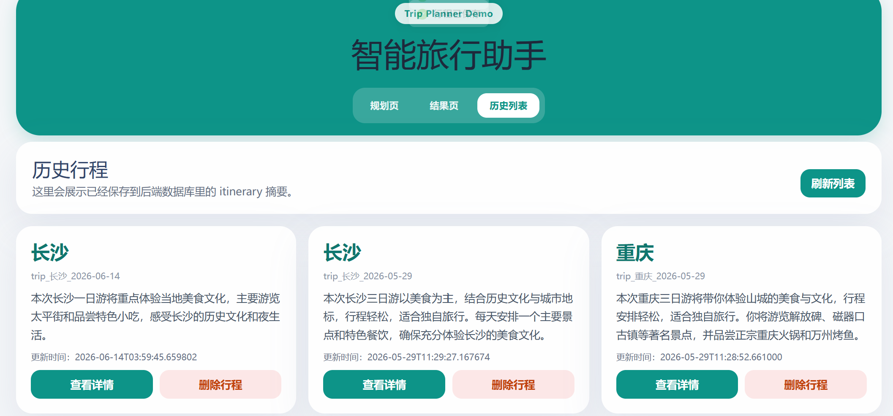
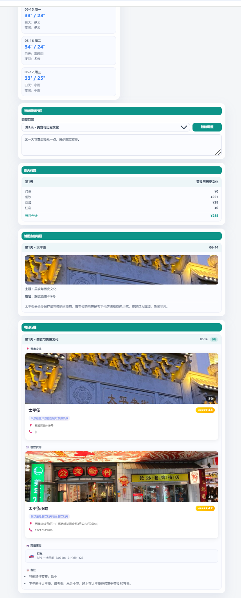

# TripMind - 智能旅行助手

> 融合大模型（LLM）、RAG 检索、高德地图与多阶段 Agent 的智能旅行规划系统

用户输入目的地、日期、预算和偏好，系统自动生成结构化旅行方案，并补充地图点位、天气信息、预算拆分与可导出文档。从行程生成到文档导出，形成完整的产品闭环。

***

## 效果展示

### 规划页



### 行程生成结果页（含地图与侧边栏）



### 行程详情（天气、预算、景点卡片）



### 历史列表



***

## 项目亮点

| 能力            | 说明                                                                             |
| :------------ | :----------------------------------------------------------------------------- |
| LLM 行程生成      | 基于 LangChain + DashScope (`qwen-max`) 生成结构化旅行计划                                |
| RAG 攻略增强      | 本地 Markdown 攻略 + Chroma 向量检索 + BM25 混合检索 + Cross-encoder Rerank，Top1 命中率 93.3% |
| 多阶段 Agent 流水线 | 5 个独立阶段（行程规划 / 地图补充 / 天气检查 / 票价校验 / 一致性检查），优雅降级，完整追踪                           |
| ReAct Agent   | 思考-行动-观察循环，支持调用 RAG、地图、天气等工具                                                   |
| MCP 架构        | 地图、天气等外部工具 MCP 化，统一聊天入口支持多种意图路由                                                |
| 高德地图接入        | 补充景点地址、坐标、POI ID、路线距离、耗时和图片，支持路线可视化                                            |
| 天气感知          | 前端展示天气预报，雨天/阴天自动修正旅行提示                                                         |
| Redis 缓存层     | 覆盖天气、地图、RAG 检索与 Rerank 结果缓存                                                    |
| 预算拆分          | 按交通、住宿、餐饮、门票等维度拆分，支持按天展示                                                       |
| 智能编辑          | 用户用自然语言调整某一天行程                                                                 |
| 文档导出          | 支持 Markdown 和中文 PDF 导出                                                         |
| 可观测性          | 全链路追踪记录、追踪查询 API、缓存统计                                                          |

***

## 技术架构

### 技术栈

| 层    | 技术                                                                        |
| :--- | :------------------------------------------------------------------------ |
| 前端   | Vue 3 + Vite + TypeScript + Ant Design Vue + Pinia + Vue Router           |
| 后端   | FastAPI + Pydantic + SQLAlchemy + Uvicorn                                 |
| LLM  | LangChain + DashScope (`qwen-max` / `qwen3-rerank` / `text-embedding-v4`) |
| 向量库  | ChromaDB                                                                  |
| 缓存   | Redis                                                                     |
| 数据库  | SQLite                                                                    |
| 外部服务 | 高德地图 Web 服务 + 高德 JavaScript API                                           |

### 架构分层

```
frontend/src/views/          ← 规划页 / 结果页 / 历史页
        ↓ HTTP
backend/app/api/routes/      ← trip / export / weather / chat / monitor / kb 路由
        ↓
backend/app/services/        ← 行程编排 / 地图 enrich / 天气 / 缓存 / 导出 / 存储
backend/app/agents/          ← LLM 行程生成 / ReAct Agent / Query Rewrite
backend/app/mcp/             ← 意图路由 / MCP 服务器 / LangGraph 工作流 / 工具拦截器
backend/app/rag/             ← 向量入库 / 检索 / Rerank / BM25 / 混合检索
backend/app/knowledge_base/  ← UGC 采集 / 多模态解析 / 质量评分 / 知识库管理
backend/data/                ← 本地 Markdown 攻略文档
```

### 系统数据流

```
前端收集用户输入
    → 后端调用 LLM + RAG 生成结构化行程
    → 地图服务补充地址、坐标、路线和图片
    → 天气服务获取预报并修正提示
    → 前端展示：地图 / 天气 / 预算 / 每日行程
    → 用户可保存 / 编辑 / 查看历史 / 导出文档
```

***

## 项目结构

```
TripMind/
├── backend/
│   ├── app/
│   │   ├── config.py                    # 全局配置与环境变量
│   │   ├── agents/
│   │   │   ├── trip_planner_agent.py    # LLM 行程生成与单日编辑
│   │   │   ├── react_agent.py           # ReAct Agent（思考-行动-观察循环）
│   │   │   └── tools/
│   │   │       └── rag_tool.py          # Query Rewrite（LLM-based + 规则 fallback）
│   │   ├── api/
│   │   │   ├── main.py                  # FastAPI 入口
│   │   │   └── routes/                  # trip / export / weather / monitor / chat / kb
│   │   ├── models/                      # Pydantic schemas + SQLAlchemy models
│   │   ├── rag/                         # vector_db / retriever / bm25_index / hybrid_retriever
│   │   ├── mcp/                         # intent_router / MCP servers / LangGraph workflow
│   │   ├── knowledge_base/              # collectors / parsers / processors / storage
│   │   ├── services/                    # trip / map / weather / cache / export / storage / ...
│   │   └── rules/                       # 旅行规则知识
│   ├── data/                            # 8 个城市攻略文档
│   ├── scripts/                         # ingest / 调试 / 测试脚本
│   ├── tests/                           # pytest 测试
│   ├── eval/                            # RAG 评估样例集
│   └── requirements.txt
├── frontend/
│   ├── src/
│   │   ├── views/                       # Home.vue / Result.vue / History.vue
│   │   ├── components/                  # AmapTripMap.vue / BusinessCard.vue
│   │   ├── services/api.ts              # Axios 封装
│   │   ├── stores/trip.ts               # Pinia 状态管理
│   │   ├── types/index.ts               # TS 类型定义
│   │   └── App.vue / main.ts / router/
│   ├── index.html
│   └── package.json
├── assets/showcase/                     # 效果截图
├── CHANGELOG.md
└── README.md
```

***

## 快速启动

> 以下命令从项目根目录 `TripMind/` 开始执行。

### 1. 启动 Redis（可选）

```bash
docker run -d --name tripmind-redis -p 6379:6379 redis:7
# 或 docker start tripmind-redis
```

在 `backend/.env` 中设置 `REDIS_ENABLED=true` 开启缓存。

### 2. 启动后端

```bash
cd backend
pip install -r requirements.txt
# 复制 .env.example 为 .env 并填写配置
uvicorn app.api.main:app --host 0.0.0.0 --port 8000
```

访问 <http://127.0.0.1:8000/docs> 查看 API 文档。

### 3. 初始化 RAG 数据

```bash
cd backend
python scripts/ingest_data.py
```

### 4. 启动前端

```bash
cd frontend
npm install
# 复制 .env.example 为 .env 并填写配置
npm run dev
```

访问 <http://127.0.0.1:5173。>

***

## 环境变量

### 后端 `backend/.env`

```env
# LLM
LLM_PROVIDER=openai_compatible
LLM_API_KEY=your_dashscope_api_key
LLM_MODEL=qwen-max
LLM_BASE_URL=https://dashscope.aliyuncs.com/compatible-mode/v1

# RAG / 向量库
CHROMA_DB_DIR=db/chroma_db
EMBEDDING_MODEL=text-embedding-v4
RERANK_MODEL=qwen3-rerank

# Redis（可选）
REDIS_ENABLED=false
REDIS_URL=redis://127.0.0.1:6379/0

# 高德地图
AMAP_API_KEY=your_amap_web_service_key
ENABLE_AMAP_ENRICHMENT=true
```

### 前端 `frontend/.env`

```env
VITE_API_BASE_URL=http://127.0.0.1:8000
VITE_AMAP_JS_KEY=your_amap_javascript_api_key
```

***

## 核心接口

| 方法     | 路径                           | 说明             |
| :----- | :--------------------------- | :------------- |
| POST   | `/trip/generate-multi-stage` | 多阶段流水线生成行程     |
| POST   | `/trip/edit`                 | 智能编辑行程         |
| POST   | `/trip/save`                 | 保存行程           |
| GET    | `/trip`                      | 历史列表           |
| GET    | `/trip/{trip_id}`            | 行程详情           |
| DELETE | `/trip/{trip_id}`            | 删除行程           |
| GET    | `/export/{trip_id}/markdown` | 导出 Markdown    |
| GET    | `/export/{trip_id}/pdf`      | 导出 PDF         |
| GET    | `/weather/forecast`          | 天气预报查询         |
| POST   | `/chat/`                     | 统一聊天入口（意图识别路由） |
| GET    | `/monitor/traces`            | 追踪记录查询         |
| GET    | `/monitor/cache`             | 缓存统计           |
| POST   | `/kb/sync`                   | UGC 知识库同步      |

***

## 关键业务链路

**行程生成**

```
Home.vue → POST /trip/generate-multi-stage
  → multi_stage_agent.py（5 阶段流水线）
    → trip_planner_agent.py（LLM + RAG）
    → map_service.py（高德 POI 补充）
    → weather_service.py（天气预报）
    → ticket_service.py（票价校验）
    → itinerary_validation_service.py（一致性校验）
  → 返回 Itinerary
```

**智能编辑**

```
Result.vue → POST /trip/edit
  → trip_planner_agent.py（LLM 单日重排）
  → 更新目标 DayPlan
```

**导出 PDF**

```
点击导出 → POST /trip/save（同步数据）
  → GET /export/{trip_id}/pdf
  → export_service.py → ReportLab 渲染 PDF
```

***

## 当前完成度

- 后端能力：行程生成 / 智能编辑 / 保存查询 / 历史列表 / 删除 / 天气 / Markdown & PDF 导出
- AI 与数据：LangChain 行程生成链路 / 8 城市攻略 RAG 检索 / Chroma 入库 / 高德地图补全
- RAG 优化：Query Rewrite + Cross-encoder Rerank + BM25 混合检索 / Top1 命中率 93.3% / MRR 0.967
- Agent 与工作流：ReAct Agent / 5 阶段流水线 / LangGraph 编排 / 意图识别路由
- MCP 架构：地图 & 天气 MCP 服务器 / 统一聊天入口 / 工具调用拦截器
- 知识库 UGC：小红书采集器 / 多模态解析 / 质量评分 / 知识库管理
- 可观测性：全链路追踪 / 追踪查询 API / 缓存统计
- 前端能力：规划页 / 结果页 / 历史页 / 地图可视化 / 天气 / 预算展示
- 持久化：SQLite 存储 + Redis 缓存层

***

## 后续方向

- [ ] GraphRAG：用图结构表达城市-景点-路线关系，增强多地点联动推荐
- [ ] 真实商户信息：接入高德 POI 详情 / 大众点评数据，卡片式展示餐饮酒店
- [ ] PDF 排版优化：分栏布局 / 中文字体 / 图片嵌入 / 天气图标
- [ ] 实时信息增强：联网搜索补充营业状态 / 热门地点 / 节假日信息
- [ ] 工程稳定性：异步任务队列 / 请求限流 / 监控告警
- [ ] 产品延展：移动端适配 / 用户登录 / 多用户隔离 / 行程分享

***

## 常见问题

**前端生成失败**
→ 检查后端是否运行在 8000 端口 / `VITE_API_BASE_URL` 是否正确 / 是否重启了前端

**地图不显示**
→ 检查 `VITE_AMAP_JS_KEY` 配置 / itinerary 中是否有经纬度字段 / `ENABLE_AMAP_ENRICHMENT=true`

**PDF 导出空白**
→ 正常流程应先看到 `POST /trip/save` 再看到 `GET /export/{trip_id}/pdf`，若只有前者需刷新前端
