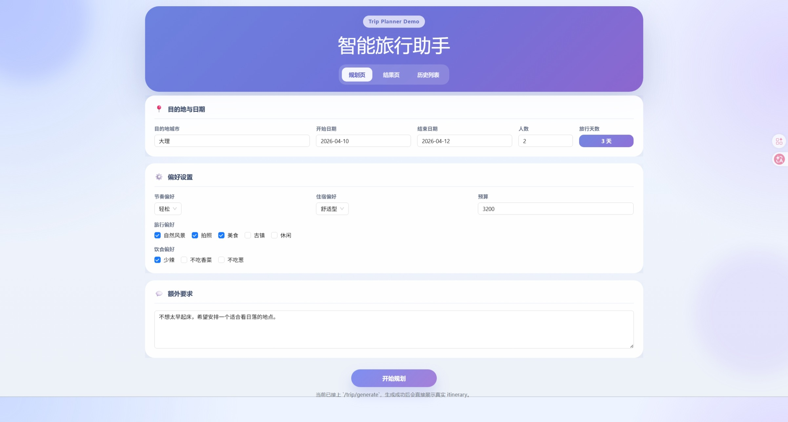
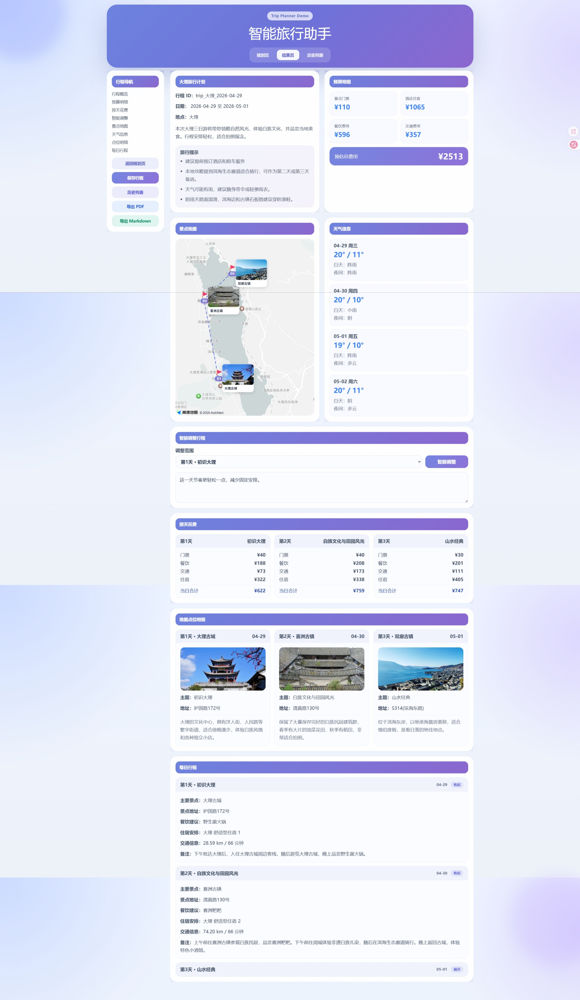
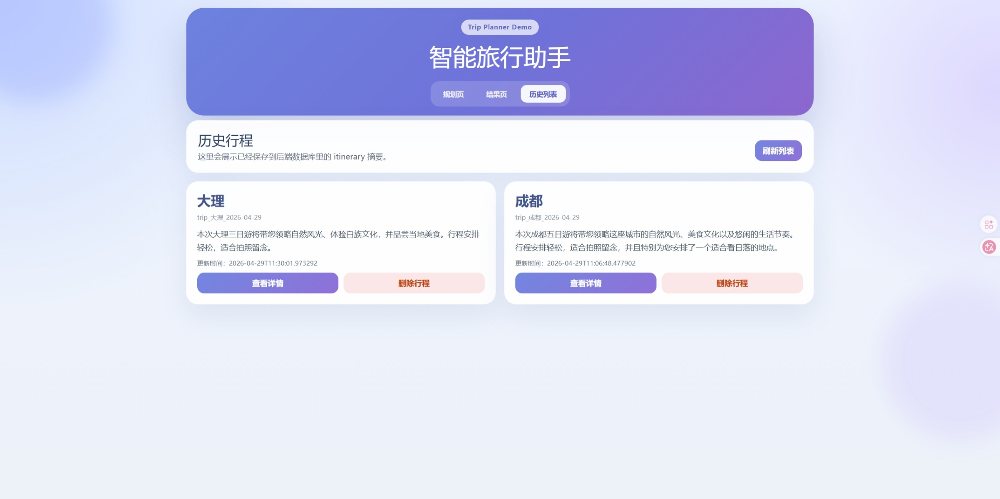
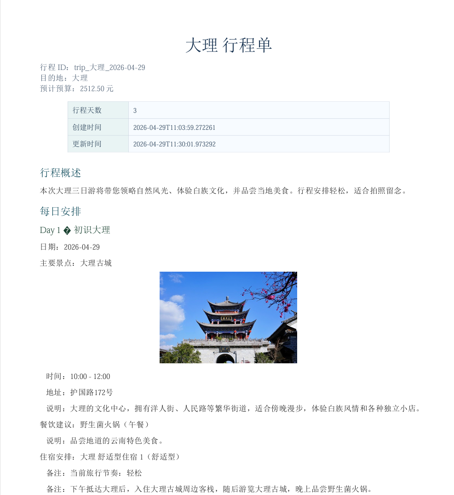
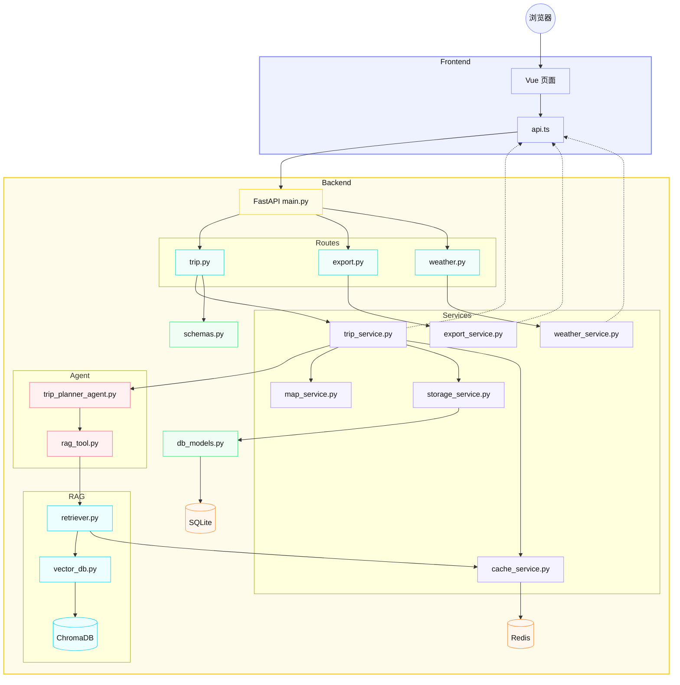
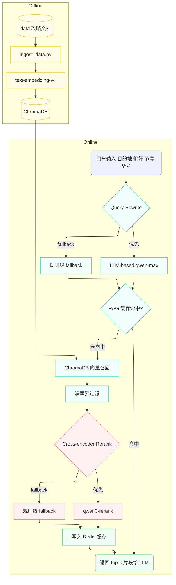

# 🗺️ 智旅云图

> 融合大模型、RAG、本地攻略与高德地图能力的智能旅行规划系统

智旅云图是一个面向中文旅行场景的 AI 旅行规划项目。用户输入目的地、日期、预算、人数和偏好后，系统会自动生成结构化旅行方案，并进一步补充地图点位、天气信息、预算拆分、景点图片与可导出的旅行文档。

相比只输出一段文本的 LLM Demo，这个项目更强调完整链路落地：从 **行程生成、攻略检索、地图信息补全、天气补充，到历史管理与文档导出**，尽量把 AI 能力组织成一个可交互、可保存、可展示的产品原型。

## 📝 最近更新

- `2026-05-28`
  - LLM 解析增强：严格 Schema 校验、失败重试机制、可观测性日志记录，提升解析可靠性
  - 行程合理性校验：新增完整的行程校验系统，包含距离/交通耗时/营业时间/预算/一致性检查
  - 多阶段 Agent 流水线：将行程生成、地图补充、天气检查、票价校验、一致性检查拆分为5个独立阶段，优雅降级，完整追踪
  - RAG 评估升级：新增用户偏好匹配度、禁用内容检测、跨城市污染检测等评估维度
  - 可观测性与调试：完成完整的追踪记录系统，支持记录用户请求、LLM调用、RAG检索、Agent执行全链路追踪，提供追踪查询API
  - 知识库管理（UGC）：新增小红书采集器、多模态解析器、质量评分器和知识库管理器，支持UGC内容的采集、解析、评分、检索与管理
  - MCP架构升级：新增意图识别路由、MCP服务器层（地图/天气/联网搜索/POI检索等），以及LangGraph工作流编排
  - ReAct Agent：实现思考-行动-观察循环的Agent，支持调用RAG、地图、天气等工具
  - 混合检索：新增BM25索引与混合检索（向量+BM25），提升检索质量
  - 统一聊天入口：新增意图识别路由，支持行程规划、编辑、天气查询、地点信息查询、文档导出、历史查询等多种意图
- `2026-05-07`
  - RAG：完成 Cross-encoder Rerank（qwen3-rerank）+ 噪声预过滤，Top1 命中率 86.7%→93.3%，MRR 0.922→0.967。
  - RAG：新增 Rerank 缓存，缓存命中后 Avg Latency 从 728ms 降至 425ms，降幅 41.6%。
- `2026-05-06`
  - RAG：完善评估指标体系，新增 MRR、Noise Rate、Latency、Cross-destination Pollution 四个量化指标。
  - RAG：完成 LLM-based Query Rewrite，用 qwen-max 替代手写规则改写检索 query，Top1 命中率 80%→86.7%，MRR 0.889→0.922。
- `2026-04-29`
  - RAG：扩充知识库至 5 个目的地（大理/成都/西安/厦门/三亚），评估样例集扩充至 15 条，完成规则级 Rerank 多层降权与 Query Rewrite 目的地过滤，消除跨目的地污染。
  - 地图前端：新增地图路线虚线箭头可视化、🚩 旗帜打卡标记与景点图片气泡窗口。
- `2026-04-25`：完成第一轮 RAG 在线阶段优化，已接入轻量化 Query Rewrite、轻量 Rerank 与检索调试脚本。
- `2026-04-15`：新增 Redis 缓存层，已覆盖天气查询、地图查询与 RAG 检索结果缓存。

更多更新见：[CHANGELOG.md](./CHANGELOG.md)


---

## 📸 效果展示

### 规划页



### 行程生成结果页



### 保存与历史管理



### PDF 导出效果



---

## ✨ 项目亮点

- 🧠 **LLM 行程生成**：基于 LangChain + DashScope 调用 `qwen-max` 生成结构化旅行计划，同时支持 ReAct Agent 思考-行动-观察循环
- 📚 **RAG 攻略增强**
  - 本地 Markdown 攻略 + Chroma 向量检索 + BM25 混合检索，为生成结果补充目的地上下文
  - 在线阶段通过 LLM-based Query Rewrite + Cross-encoder Rerank（qwen3-rerank）+ 噪声预过滤持续优化检索质量，Top1 命中率 93.3%，MRR 0.967
  - UGC 知识库管理：支持小红书采集、多模态解析、质量评分、检索与管理
- 🤖 **Agent 与工作流**
  - ReAct Agent：思考-行动-观察循环，支持调用 RAG、地图、天气等工具
  - LangGraph 工作流编排：支持条件分支与并行执行
  - 意图识别路由：基于 LLM 的意图识别，自动分发到对应处理链路
- 🔌 **MCP 架构**
  - 外部工具 MCP 化：地图、天气、联网搜索、POI 检索封装为 MCP 工具
  - 统一聊天入口：支持行程规划、编辑、天气查询、地点信息查询、文档导出、历史查询等多种意图
- 🗺️ **高德地图接入**：补充景点地址、经纬度、POI ID、路线距离、耗时和景点图片，并支持虚线箭头路线可视化与 🚩 打卡标记
- 🌦️ **天气感知提示**：前端展示天气预报，并根据雨天/阴天自动修正旅行提示
- ⚡ **Redis 缓存层**：覆盖天气、地图、RAG 检索与 Rerank 结果缓存，减少重复外部调用开销
- 💰 **预算拆分**：按交通、住宿、餐饮、门票、其他费用拆分，并支持按天展示
- 🪄 **智能编辑**：支持用户用自然语言调整某一天行程
- 🗂️ **历史管理**：支持保存、查看、打开、删除历史 itinerary
- 📄 **文档导出**：支持 Markdown 和中文 PDF 导出，导出前自动同步当前页面数据
- 🖥️ **前端可视化**：提供规划页、结果页和历史页，完成核心业务闭环展示
- 🔍 **可观测性与调试**
  - 全链路追踪：记录用户请求、LLM调用、RAG检索、Agent执行
  - 追踪查询API：支持分页查询和详情查看
  - 缓存统计：查看缓存命中情况

---

## 🏗️ 技术架构

### 技术栈

- 后端：FastAPI + Pydantic + SQLAlchemy
- LLM：LangChain + DashScope (`qwen-max`)
- 向量库：ChromaDB
- 缓存：Redis
- 外部服务：HTTPX + 高德地图 Web 服务 + 高德 JavaScript API
- 前端：Vue 3 + Vite
- 数据库：SQLite

### 核心架构分层

| 层级 | 关键文件 | 职责 |
| :--- | :--- | :--- |
| 前端 | `frontend/src/views/*.vue` | 规划页、结果页、历史页展示与交互 |
| 接口层 | `backend/app/api/routes/` | trip、export、weather、monitor、chat、kb 路由 |
| 服务层 | `backend/app/services/` | 行程编排、地图 enrich、天气、缓存、导出、存储、追踪、UGC 管理 |
| Agent 层 | `backend/app/agents/` | LLM 行程生成 + LLM-based Query Rewrite + ReAct Agent |
| MCP 层 | `backend/app/mcp/` | 意图识别路由、MCP 服务器（地图/天气/联网搜索/POI）、LangGraph 工作流、工具拦截器 |
| RAG 层 | `backend/app/rag/` | 向量入库、检索、Cross-encoder Rerank、BM25 索引、混合检索 |
| 知识库层 | `backend/app/knowledge_base/` | UGC 采集器、多模态解析器、质量评分器、知识库管理器 |
| 数据层 | `backend/data/` | 本地 Markdown 攻略文档 + UGC 知识库 |

### 系统数据流



数据流路径：前端收集用户输入 → 后端调用 LLM + RAG 生成结构化行程 → 地图服务补充地址、坐标、路线和图片 → 前端展示地图、天气、预算和每日行程 → 用户可保存、编辑、查看历史并导出文档。

### RAG 检索流程



---

## 📁 项目结构

```text
TripPlannerDemo/
├── backend/
│   ├── app/
│   │   ├── config.py          # 环境变量、数据库 Base、全局配置
│   │   ├── agents/
│   │   │   ├── trip_planner_agent.py    # LLM 行程生成与单日编辑逻辑
│   │   │   ├── react_agent.py           # ReAct Agent：思考-行动-观察循环
│   │   │   └── tools/
│   │   │       └── rag_tool.py          # Query Rewrite：LLM-based 改写 + 规则级 fallback
│   │   ├── api/
│   │   │   ├── main.py                  # FastAPI 应用入口
│   │   │   └── routes/
│   │   │       ├── trip.py              # 生成、编辑、保存、查询、删除接口
│   │   │       ├── export.py            # Markdown / PDF 导出接口
│   │   │       ├── weather.py           # 天气预报接口
│   │   │       ├── monitor.py           # 可观测性与调试：追踪查询、缓存统计
│   │   │       ├── chat.py              # 统一聊天入口：意图识别路由
│   │   │       └── knowledge_base.py    # UGC 知识库管理接口
│   │   ├── models/
│   │   │   ├── schemas.py               # Pydantic 请求体 / 响应体 / itinerary / 追踪模型
│   │   │   └── db_models.py             # SQLAlchemy 数据库表定义
│   │   ├── rag/
│   │   │   ├── vector_db.py             # Markdown 切片、Chroma 入库与检索
│   │   │   ├── retriever.py             # 检索封装、RAG 缓存、Cross-encoder Rerank + 规则级 fallback
│   │   │   ├── bm25_index.py            # BM25 索引与检索
│   │   │   └── hybrid_retriever.py      # 混合检索（向量 + BM25）
│   │   ├── mcp/
│   │   │   ├── intent_router.py         # 意图识别与路由
│   │   │   ├── langchain_agent.py       # MCP 化的 Agent
│   │   │   ├── langgraph_workflow.py    # LangGraph 工作流编排
│   │   │   ├── interceptors.py          # 工具调用拦截器
│   │   │   ├── amap_server.py           # 高德地图 MCP 服务器
│   │   │   ├── weather_server.py        # 天气 MCP 服务器
│   │   │   ├── amap_http_server.py      # 高德地图 HTTP MCP 服务
│   │   │   ├── weather_http_server.py   # 天气 HTTP MCP 服务
│   │   │   ├── http_server.py           # HTTP MCP 服务基类
│   │   │   └── client.py                # MCP 客户端
│   │   ├── knowledge_base/
│   │   │   ├── collectors/
│   │   │   │   ├── base_collector.py    # 采集器基类
│   │   │   │   └── xiaohongshu_collector.py # 小红书帖子采集器
│   │   │   ├── parsers/
│   │   │   │   └── multimodal_parser.py # 多模态解析器（图文分析）
│   │   │   ├── processors/
│   │   │   │   └── quality_scorer.py    # 内容质量评分器
│   │   │   └── storage/
│   │   │       └── kb_manager.py        # 知识库管理器
│   │   └── services/
│   │       ├── trip_service.py          # 行程主编排逻辑、预算计算、地图 enrich
│   │       ├── cache_service.py         # Redis 缓存封装与降级逻辑
│   │       ├── map_service.py           # 高德地图 POI、地理编码、路线、图片补充
│   │       ├── weather_service.py       # 高德天气服务封装
│   │       ├── storage_service.py       # SQLite 保存、查询、列表、删除
│   │       ├── export_service.py        # Markdown / PDF 渲染与导出
│   │       ├── tracing_service.py       # 追踪记录服务
│   │       ├── web_spot_service.py      # 景点信息服务
│   │       └── ticket_service.py        # 门票信息服务
│   ├── data/                  # 本地攻略文档
│   ├── eval/                  # RAG 检索评估样例集
│   ├── scripts/               # ingest、地图验证、RAG 调试与评估脚本
│   ├── tests/                 # pytest 测试
│   ├── .env.example           # 后端环境变量模板
│   └── requirements.txt
├── frontend/
│   ├── src/
│   │   ├── services/
│   │   │   └── api.ts                   # Axios 封装与前端 API 调用
│   │   ├── types/
│   │   │   └── index.ts                 # TypeScript 数据类型定义
│   │   ├── views/
│   │   │   ├── Home.vue                 # 规划页
│   │   │   ├── Result.vue               # 结果展示页
│   │   │   └── History.vue              # 历史列表页
│   │   ├── components/
│   │   │   └── AmapTripMap.vue          # 地图展示组件
│   │   ├── App.vue                      # 页面切换入口
│   │   └── main.ts                      # 前端入口
│   ├── .env.example           # 前端环境变量模板
│   └── package.json
├── assets/
│   └── showcase/              # README 展示截图
├── CHANGELOG.md               # 项目功能与架构更新日志
├── .gitignore
└── README.md
```

> `docs/` 是本地开发与面试准备文档目录，默认已被 `.gitignore` 忽略，不随 GitHub 上传。

### 关键文件职责

**后端**

- `backend/app/services/trip_service.py`
  itinerary 主流程编排，包括天数拆分、预算估算、地图 enrich 以及编辑后的统一刷新，支持追踪记录。
- `backend/app/services/cache_service.py`
  Redis 客户端懒加载、JSON 缓存读写与 Redis 不可用时的优雅降级。
- `backend/app/agents/trip_planner_agent.py`
  调用大模型生成结构化旅行草稿，并处理单日编辑时的 LLM 输出。
- `backend/app/agents/react_agent.py`
  ReAct Agent：思考-行动-观察循环，支持调用 RAG、地图、天气等工具。
- `backend/app/agents/tools/rag_tool.py`
  RAG 在线阶段的 Query Rewrite，优先 LLM-based 改写（qwen-max），fallback 到规则级关键词提取。
- `backend/app/rag/retriever.py`
  向量召回结果封装、RAG 缓存、Cross-encoder Rerank（qwen3-rerank）+ Rerank 缓存，fallback 到规则级打分。
- `backend/app/rag/bm25_index.py`
  BM25 索引与检索，用于混合检索。
- `backend/app/rag/hybrid_retriever.py`
  混合检索器（向量 + BM25），提升检索质量。
- `backend/app/services/map_service.py`
  对接高德地图 Web 服务，结合 Redis 缓存补充地址、经纬度、路线估算和景点图片。
- `backend/app/services/export_service.py`
  itinerary 渲染为 Markdown 与中文 PDF。
- `backend/app/services/storage_service.py`
  SQLite 数据保存、读取、历史列表和删除。
- `backend/app/services/tracing_service.py`
  追踪记录服务，支持创建、记录、查询和管理追踪记录。
- `backend/app/mcp/intent_router.py`
  意图识别与路由，基于 LLM 识别用户意图并分发到对应处理链路。
- `backend/app/mcp/langgraph_workflow.py`
  LangGraph 工作流编排，支持条件分支与并行执行。
- `backend/app/mcp/amap_server.py`
  高德地图 MCP 服务器，封装地图相关工具。
- `backend/app/mcp/weather_server.py`
  天气 MCP 服务器，封装天气相关工具。
- `backend/app/knowledge_base/collectors/xiaohongshu_collector.py`
  小红书帖子采集器。
- `backend/app/knowledge_base/parsers/multimodal_parser.py`
  多模态解析器，支持图文分析。
- `backend/app/knowledge_base/processors/quality_scorer.py`
  内容质量评分器。
- `backend/app/knowledge_base/storage/kb_manager.py`
  知识库管理器，支持 UGC 内容的入库、查询和管理。
- `backend/scripts/debug_rag_retrieval.py`
  RAG 在线阶段调试，输出检索 query、top-k 召回片段、`rerank_score` 与 `rerank_reasons`。
- `backend/scripts/evaluate_rag_retrieval.py`
  RAG 检索效果评估，输出 Top1/TopK 命中率、MRR、Noise Rate、Latency 与跨目的地污染指标。
- `backend/eval/rag_eval_cases.json`
  RAG 检索评估样例集，用于对比优化前后的效果变化。

**前端**

- `frontend/src/services/api.ts`
  Axios 封装与后端接口通信。
- `frontend/src/views/Home.vue`
  规划页，收集用户输入并发起行程生成请求。
- `frontend/src/views/Result.vue`
  结果展示页，承接 itinerary、地图、天气和导出交互。
- `frontend/src/views/History.vue`
  历史列表页，支持查看、打开和删除历史行程。
- `frontend/src/components/AmapTripMap.vue`
  高德地图组件，展示路线可视化与景点标记。

---

## 🚀 快速启动

以下命令默认从项目根目录 `TripPlannerDemo/` 开始执行。

### 1. 启动 Redis（可选）

```bash
docker run -d --name tripplanner-redis -p 6379:6379 redis:7
```

如果已创建过容器：

```bash
docker start tripplanner-redis
```

在 `backend/.env` 中设置 `REDIS_ENABLED=true` 开启缓存（天气、地图、RAG 检索与 Rerank 结果）。

### 2. 启动后端

```bash
cd TripPlannerDemo
cd backend
pip install -r requirements.txt
# 手动复制 .env.example 为 .env，并填写你的配置
uvicorn app.api.main:app --host 0.0.0.0 --port 8000
```

启动后访问：

```text
http://127.0.0.1:8000/
http://127.0.0.1:8000/docs
```

### 3. 启动前端

```bash
cd TripPlannerDemo
cd frontend
npm install
# 手动复制 .env.example 为 .env，并填写你的配置
npm run dev
```

启动后访问：

```text
http://127.0.0.1:5173
```

---

## 🔐 环境变量

### 后端 `backend/.env`

```env
# LLM
LLM_PROVIDER=openai_compatible          # 固定值，使用 OpenAI 兼容接口
LLM_API_KEY=your_dashscope_api_key      # DashScope API Key
LLM_MODEL=qwen-max                      # 生成模型
LLM_BASE_URL=https://dashscope.aliyuncs.com/compatible-mode/v1
LLM_TIMEOUT_SECONDS=60                  # 单次 LLM 调用超时
LLM_MAX_RETRIES=1                       # 失败重试次数

# RAG / 向量库
CHROMA_DB_DIR=db/chroma_db              # ChromaDB 持久化目录
CHROMA_COLLECTION_NAME=travel_guides    # 集合名称
EMBEDDING_MODEL=text-embedding-v4       # DashScope 嵌入模型
EMBEDDING_BATCH_SIZE=10                 # 单批嵌入条数
RERANK_MODEL=qwen3-rerank              # DashScope Rerank 模型

# Redis / 缓存
REDIS_ENABLED=false                     # 是否开启缓存（需先启动 Redis）
REDIS_URL=redis://127.0.0.1:6379/0     # Redis 连接地址
REDIS_KEY_PREFIX=trip_planner           # 缓存 key 前缀，避免多项目冲突
REDIS_DEFAULT_TTL_SECONDS=1800          # 默认缓存 30 分钟
REDIS_WEATHER_TTL_SECONDS=1800          # 天气缓存 30 分钟
REDIS_MAP_TTL_SECONDS=86400             # 地图缓存 24 小时
REDIS_RAG_TTL_SECONDS=21600             # RAG 检索缓存 6 小时
REDIS_RERANK_TTL_SECONDS=21600          # Rerank 缓存 6 小时

# 高德地图
AMAP_API_KEY=your_amap_web_service_key  # 高德 Web 服务 Key
AMAP_BASE_URL=https://restapi.amap.com/v3
AMAP_DEFAULT_CITY=                      # 默认城市（可留空）
AMAP_TIMEOUT_SECONDS=20                 # 高德接口超时
ENABLE_AMAP_ENRICHMENT=true             # 是否开启地图信息补全
```

### 前端 `frontend/.env`

```env
VITE_API_BASE_URL=http://你的服务器地址:8000
VITE_AMAP_JS_KEY=your_amap_javascript_api_key
```

注意：

- 如果浏览器在本机打开，`VITE_API_BASE_URL` 不要写远程服务器内部的 `127.0.0.1`
- 后端高德 key 使用 Web 服务 key
- 前端地图 key 使用 JavaScript API key
- 修改 `.env` 后需要重启对应服务

---

## 🧠 RAG 数据初始化

首次使用 Chroma 检索前，执行：

```bash
cd backend
python scripts/ingest_data.py
```

成功后会看到类似结果：

```text
written_count: 9
```

---

## 📡 核心接口

| 方法 | 路径 | 说明 |
| :--- | :--- | :--- |
| `GET` | `/` | 服务启动检查 |
| `GET` | `/health` | 健康检查 |
| `POST` | `/trip/generate` | 生成行程（自动追踪） |
| `POST` | `/trip/edit` | 智能编辑行程 |
| `POST` | `/trip/save` | 保存行程 |
| `GET` | `/trip` | 历史列表 |
| `GET` | `/trip/{trip_id}` | 行程详情 |
| `DELETE` | `/trip/{trip_id}` | 删除行程 |
| `POST` | `/trip/generate-react` | 使用 ReAct Agent 生成行程 |
| `GET` | `/trip/react/tools` | 获取 ReAct Agent 可用工具 |
| `GET` | `/export/{trip_id}/markdown` | 导出 Markdown |
| `GET` | `/export/{trip_id}/pdf` | 导出 PDF |
| `GET` | `/weather/forecast` | 查询天气 |
| `POST` | `/chat/` | 统一聊天入口（意图识别路由） |
| `POST` | `/chat/intent` | 仅意图识别 |
| `GET` | `/monitor/cache` | 获取缓存统计 |
| `GET` | `/monitor/traces` | 列出追踪记录（支持分页、过滤） |
| `GET` | `/monitor/traces/{trace_id}` | 获取单个追踪详情 |
| `DELETE` | `/monitor/traces` | 清空所有追踪记录 |
| `POST` | `/kb/sync` | 同步知识库（从平台采集） |
| `POST` | `/kb/import` | 导入帖子（从上传文件） |
| `GET` | `/kb/stats` | 获取知识库统计 |
| `POST` | `/kb/search` | 搜索 UGC 内容 |
| `DELETE` | `/kb/clear` | 清空知识库 |

---

## 🧪 测试与验证

### 后端 API 测试

```bash
cd backend
pytest tests/test_api_trip.py -q
```

如果服务器测试目录是 `backend/test`：

```bash
cd backend/test
pytest test_api_trip.py -q
```

### 高德服务测试

```bash
cd backend/scripts
python test_map_service.py
```

### 真实行程生成测试

```bash
cd backend/scripts
python test_trip_service_real.py
```

---

## 🔄 关键业务链路

### 行程生成

```text
Home.vue
  -> POST /trip/generate
  -> trip_service.py
  -> trip_planner_agent.py
  -> rag_tool.py / vector_db.py
  -> map_service.py
  -> Itinerary
```

### 智能编辑

```text
Result.vue
  -> POST /trip/edit
  -> trip_service.py
  -> generate_day_edit_draft()
  -> 更新目标 DayPlan
```

### PDF 导出

```text
点击导出 PDF
  -> 前端先 POST /trip/save
  -> 再 GET /export/{trip_id}/pdf
  -> export_service.py
  -> ReportLab 生成 PDF
```

---

## 🛠️ 常见问题

### 前端生成失败

优先检查：

- 后端是否启动在 `8000`
- `frontend/.env` 的 `VITE_API_BASE_URL` 是否正确
- 修改 `.env` 后是否重启前端
- 浏览器控制台是否有网络错误

### 地图不显示

优先检查：

- `VITE_AMAP_JS_KEY` 是否配置
- 高德 JavaScript API key 是否可用
- itinerary 中是否有经纬度字段
- 后端 `ENABLE_AMAP_ENRICHMENT` 是否为 `true`

### PDF 导出空白页

正常导出时后端应看到：

```text
POST /trip/save
GET /export/{trip_id}/pdf
```

如果只有 `POST /trip/save`，说明前端没有成功跳转到导出地址，需要刷新前端或重启 Vite。

### `npm run dev` 找不到 `package.json`

说明目录错了。前端命令必须在 `frontend/` 目录执行：

```bash
cd frontend
```

---

## ✅ 当前完成度

- ✅ **后端能力**：行程生成、智能编辑、保存查询、历史列表、删除、天气查询、Markdown 导出与 PDF 导出接口
- ✅ **AI 与数据能力**：LangChain 行程生成链路、5 个目的地攻略 RAG 检索、Chroma 入库检索、高德地图地址/坐标/路线/图片补充
- ✅ **RAG 在线优化**：LLM-based Query Rewrite + Cross-encoder Rerank（qwen3-rerank）+ 噪声预过滤 + Rerank 缓存、检索调试脚本与 15 条评估样例集、量化评估指标体系（Top1/TopK Hit Rate、MRR、Noise Rate、Latency、Cross-destination Pollution）
- ✅ **RAG 增强**：BM25 索引 + 混合检索（向量 + BM25）
- ✅ **Agent 与工作流**：ReAct Agent（思考-行动-观察循环）、LangGraph 工作流编排、意图识别路由
- ✅ **MCP 架构**：地图 MCP 服务器、天气 MCP 服务器、工具调用拦截器、统一聊天入口
- ✅ **知识库管理（UGC）**：小红书采集器、多模态解析器、内容质量评分器、知识库管理器
- ✅ **可观测性与调试**：全链路追踪记录、追踪查询 API、缓存统计
- ✅ **前端能力**：规划页、结果页、历史列表页，以及地图/天气/预算展示、导出与历史管理主流程
- ✅ **缓存与持久化**：SQLite 持久化存储 + Redis 缓存层（覆盖天气、地图、RAG 检索与 Rerank 结果）
- ✅ **验证情况**：核心链路稳定跑通，Redis 缓存 key 可在本地容器中验证写入，追踪功能测试通过

---

## 🌱 后续优化方向

- ✅ **缓存与工程化能力（已完成）**
  已完成 Redis 缓存层，覆盖天气查询、地图查询、RAG 检索结果与 Rerank 结果缓存；后续可扩展到会话态管理、热点目的地复用与更细粒度的缓存命中统计。
- ✅ **RAG 检索增强（已完成核心优化）**
  - ✅ 规则级 Query Rewrite → LLM-based Query Rewrite（qwen-max），Top1 80%→86.7%，MRR 0.889→0.922。
  - ✅ 规则级 Rerank → Cross-encoder Rerank（qwen3-rerank）+ 噪声预过滤 + Rerank 缓存，Top1 86.7%→93.3%，MRR 0.922→0.967。
  - ✅ 知识库扩充至 5 个目的地，评估样例集 15 条，量化评估指标体系完整。
  - ✅ 混合检索（向量 + BM25），提升检索质量。
  - ✅ **RAG 评估升级**：新增用户偏好匹配度、禁用内容检测、跨城市污染检测等评估维度。
  - 🚧 更高阶方向可尝试 GraphRAG，用图结构表达城市、景点、路线与主题标签之间的关系，增强多地点联动推荐和行程合理性约束。
- ✅ **知识库来源扩充（已完成框架）**
  - ✅ 小红书采集器
  - ✅ 多模态解析器（图文分析）
  - ✅ 内容质量评分器
  - ✅ 知识库管理器
  - 🚧 继续完善采集流程和内容质量评估。
- ✅ **Agent 与工作流编排（已完成）**
  - ✅ ReAct Agent：思考-行动-观察循环
  - ✅ **多阶段 Agent 流水线**：5个独立阶段（行程规划/地图补充/天气检查/票价校验/一致性检查）+ 优雅降级 + 完整追踪
  - ✅ LangGraph 工作流编排
  - ✅ 意图识别路由
  - 🚧 优化工作流的分支逻辑和并行执行。
- ✅ **外部工具与 MCP 化（已完成）**
  - ✅ 地图 MCP 服务器
  - ✅ 天气 MCP 服务器
  - ✅ 工具调用拦截器
  - 🚧 继续完善更多外部工具的 MCP 化。
- ✅ **LLM 解析增强（已完成）**
  - ✅ 严格 Schema 校验
  - ✅ 失败重试机制
  - ✅ 可观测性日志记录
- ✅ **行程合理性校验（已完成）**
  - ✅ 距离/交通耗时校验
  - ✅ 营业时间校验
  - ✅ 预算校验
  - ✅ 一致性检查
- ✅ **可观测性与调试（已完成）**
  - ✅ 全链路追踪记录
  - ✅ 追踪查询 API
  - ✅ 缓存统计
  - 🚧 可进一步扩展到更完善的监控和告警系统。
- 🚧 **真实商户信息展示**
  后端接入真实餐饮、酒店/民宿数据（如高德 POI 详情、大众点评等），泛化为结构化数据（名称、地址、评分、人均、图片等），前端以卡片形式展示，提升行程的实用性和可信度。
- 🚧 **PDF 导出优化**
  当前 PDF 可读性较低，后续可优化排版（分栏、卡片式布局）、中文字体、景点图片嵌入、天气图标和路线示意图，生成更接近旅行手册风格的导出文档。
- 🚧 **实时信息增强**
  可接入联网搜索能力，补充景点营业状态、近期热门地点、节假日信息与实时出行建议，让本地攻略 RAG 与实时信息形成互补。
- 🚧 **性能与稳定性**
  可以加入异步任务队列、请求限流、失败重试、监控告警，提升真实部署场景下的稳定性。
- 🚧 **产品能力延展**
  可以继续增强移动端适配、用户登录、多用户隔离、行程对比和行程分享等产品能力。
